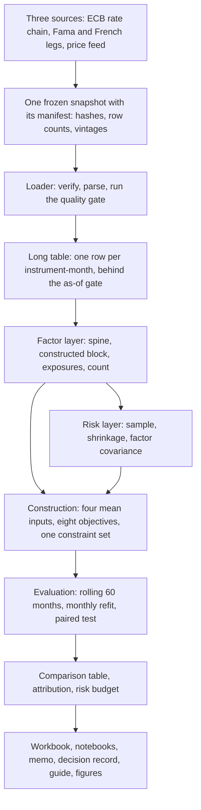
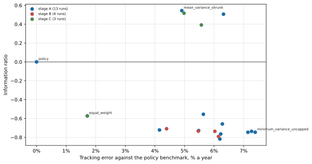
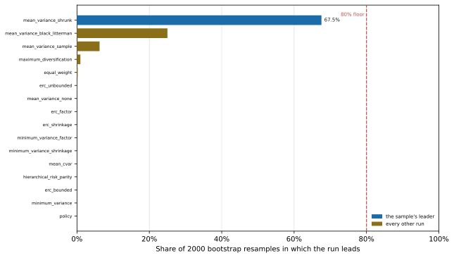
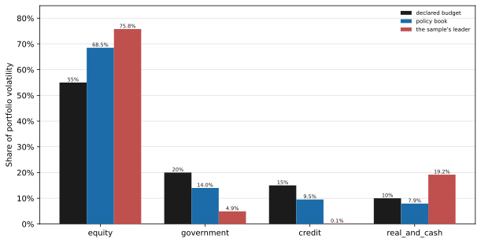
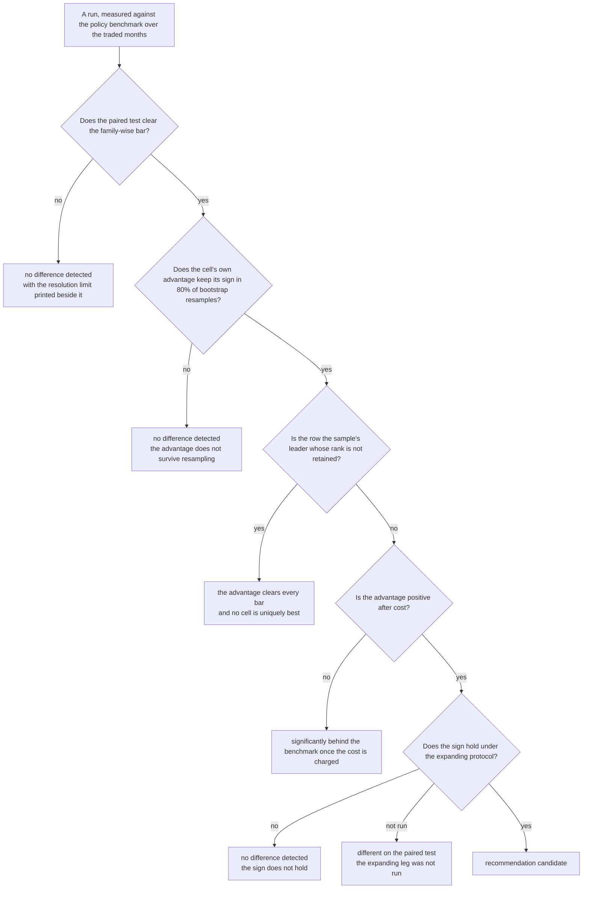
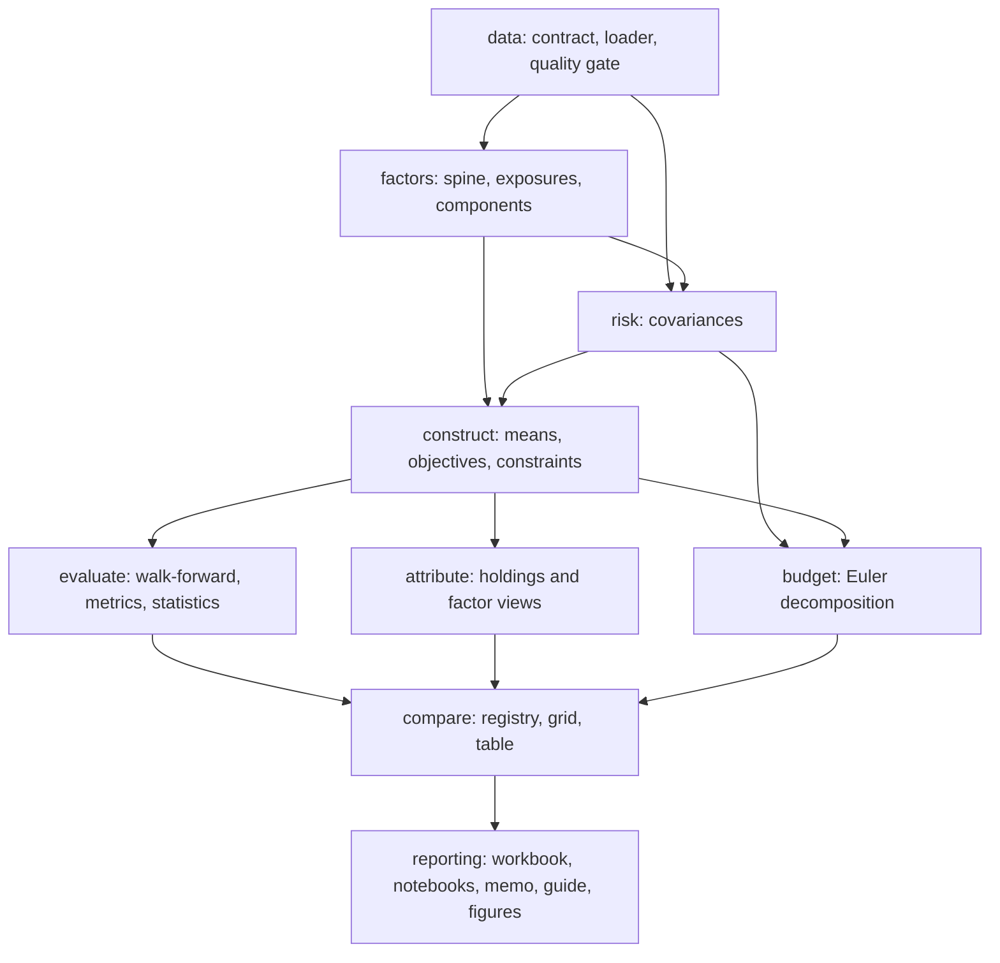

# portfolio-workbench

A methodology comparison for European multi-asset portfolio construction, run out of sample on one
frozen panel. A committee holding a balanced mandate at fixed strategic weights asks a question it asks
at every review: would a different construction method have produced a better book once cost is
charged? This repository answers it by running the candidates side by side on one universe and one
mandate, and reporting which choices moved the outcome, on which metric, and at what cost.

*A learning exercise performed in role: a simulated mandate with no client and no institution.
Nothing in this repository is investment advice, a recommendation to any person, or a client
communication.*

---

## What this does

A mandate is a set of weights, a universe and a benchmark, and construction is the act of choosing
those weights. Practitioners choose between families that ask different questions of the same inputs.

| Family | The question it asks |
| --- | --- |
| Minimum variance | Which book has the smallest variance? |
| Equal risk contribution | Which makes every sleeve's contribution to volatility equal? |
| Maximum diversification | Which gets the most diversification out of the covariance? |
| Mean-variance | Which trades expected return against variance at a stated risk aversion? |
| Mean-CVaR | Which minimises the average loss in the tail of its own window? |
| Hierarchical risk parity | Which allocates by bisecting a clustered correlation matrix? |

Each family consumes a different set of inputs, and the literature is unusually united on one point:
the mean is the input carrying the most estimation error.

A committee can leave the book alone, in which case it trades nothing and pays nothing, or it can adopt
a constructed book, in which case it pays the cost of getting there and of staying there. So the question
here is not which method is best in general, but which methodological choices move the outcome on this
mandate, by how much, on which metric, and what the change costs. What comes out is a table of verdicts
on sixteen cells, not a ranking, and the negative results are published beside the positive ones.

---

## The exercise in one picture



Every number in every output comes off that one path. Nothing downstream of the table re-reads a raw
file, and nothing upstream of it estimates anything.

---

## How the comparison is built

| Layer | What it decides | Module | Entry point |
| --- | --- | --- | --- |
| Data | The panel, its coverage, and what a moment is allowed to see | `data/` | `python3 -m portfolio_workbench.data.coverage` |
| Factors | The exposure of each sleeve to the named spine and the constructed block | `factors/` | `.factors.spine`, `.factors.exposures`, `.factors.components`, `.factors.spanning` |
| Risk | The covariance each constructor is handed | `risk/` | `python3 -m portfolio_workbench.risk.covariance` |
| Construction | The weight vector, given a mean and a covariance | `construct/` | via `.compare.grid` |
| Evaluation | Whether a difference between two books is claimable | `evaluate/` | `python3 -m portfolio_workbench.evaluate.walkforward` |
| Comparison | Every cell's verdict, and the table it is read from | `compare/` | `python3 -m portfolio_workbench.compare.grid` |
| Attribution | Where the active return came from, on holdings and on factors | `attribute/` | `.attribute.brinson`, `.attribute.factor` |
| Risk budget | Where the realised volatility actually went | `budget/` | `python3 -m portfolio_workbench.budget.euler` |
| Assembly | One snapshot, one run, one object every reading is taken off | `study.py` | `python3 -m portfolio_workbench.study` |
| Boundary | The contract and five entry points a consumer adopts | `facade.py` | `python3 -m portfolio_workbench.facade` |

**The data contract.** Three sources feed one frozen snapshot: the European Central Bank's Data Portal
for the overnight rate chain, spliced from EONIA to the euro short-term rate at the transition with the
overlap measured rather than assumed; the Fama/French archives for the developed-market factor legs; and
a public price feed for the fund bars, read with the feed's adjusted close as the total-return proxy.
The snapshot carries a manifest of instruments, file hashes, row counts and factor vintages, which the
loader verifies on every read and fails closed on. The as-of rule gates every join: a month's bar
becomes readable on the first day of the following month. Without that gate, a window estimated at the
end of March reads March's own return, which is look-ahead bias of one month and is nearly invisible in
a performance table.

**The factor layer.** The eleven sleeves are funds rather than firms, so the security-level style and
industry attributes a commercial risk model would use are not available. What is available is a set of
published index legs, called the named spine, and the sleeves' own construction, assembled into a
constructed block of level, slope, credit and high-yield lines. The block's arithmetic is deliberately
trivial: its loadings on four sleeves are identities rather than estimates, which is what makes those
four checkable instead of merely fitted. Exposures are estimated per window and refitted monthly, with
the block orthogonalised against itself so that each later loading is the clean reading. The
statistical family is principal components, and the count is decided by a rule declared before it was
applied: a component is retained when its eigenvalue beats the 95th percentile of a matched permutation
null built from the panel's own marginals. Principal components extract directions of common variation;
they do not select factors and they do not identify which directions are priced, so the count comes
from that external criterion rather than from the extraction.

**The risk layer.** Three covariance estimators sit behind one interface: the sample covariance, linear
shrinkage toward a structured target at an intensity the estimator estimates, and the covariance
implied by the retained components. What that axis varies is the conditioning of the matrix handed to
the optimiser, and it is reported as such. There is no true covariance on this panel to rank the
estimators against, and a sample covariance is by construction the best fit to its own window, so an
accuracy ranking would rank whichever estimator it was computed from first.

**The construction layer.** Four mean inputs and the family list are crossed under one constraint set.
The mean inputs are the sample mean, a shrunk mean, a Black-Litterman posterior whose prior is implied
by the mandate's own weights, and no mean at all. The no-mean cell is the control: it isolates how much
of each other cell's result the solver and the constraints were producing on their own.

**The evaluation layer.** Every cell is estimated on a rolling sixty months with a monthly refit and
trades only after its window ends. Comparing cells by their separate estimates would be useless at this
length, since one strategy's annualised ratio carries an interval wide enough that nearly every method
sits inside every other's. Every comparison is therefore a paired test on the difference of two monthly
return series, which works because the cells share a universe, a set of months and long-only books and
are consequently highly correlated.

**Attribution and the risk budget.** The active return is decomposed twice, on the holdings in the
Brinson-Fachler form and through the fitted factor exposures, and the two views are never summed
because they read the same return in different bases. Allocation-only is a structural fact rather than
a simplification: the benchmark holds the same instrument in each sleeve, so the selection term does
not exist, and the currency dimension carries the interaction instead. The risk budget reads the
realised volatility contributions against the vector the mandate declared, using Euler contributions,
and value at risk is refused as a decomposition with the measurement that justifies the refusal, since
its conditional contributions do not sum to it.

**One run, one object.** `portfolio_workbench/study.py` assembles a snapshot's run and every reading
taken off it, so the comparison table, the workbook, the findings memo and the learning guide cannot
describe different runs. Nine call sites used to assemble it for themselves, and two of them disagreed
about the months a covariance was read over.

The learning guide (`reporting/learning-guide.md`) walks through all of it with citations and the
alternatives each layer displaced.

---

## What is being compared

Twenty pre-registered runs over sixteen distinct cells. The axes move one at a time: the family axis
varies the objective at one covariance and one default mean, the risk-model axis varies the estimator
across the two most covariance-dependent families, and the mean axis varies the input inside
mean-variance. Two perturbation runs lift the per-sleeve cap and change nothing else, so a result that
came from the constraint set rather than from the method is visible as such, and two repeats re-run the
cells the mandate's question turns on under the expanding protocol.

| Cell | Stage | Family | Covariance | Mean | Protocol | Cap |
| --- | --- | --- | --- | --- | --- | --- |
| `equal_weight` | A | `equal_weight` | sample | default | rolling | 35% |
| `policy` | A | `policy` | sample | default | rolling | 35% |
| `mean_variance_shrunk` | A | `mean_variance` | sample | jorion | rolling | 35% |
| `minimum_variance` | A | `minimum_variance` | sample | default | rolling | 35% |
| `maximum_diversification` | A | `maximum_diversification` | sample | default | rolling | 35% |
| `erc_unbounded` | A | `erc` | sample | default | rolling | uncapped |
| `erc_bounded` | A | `erc` | sample | default | rolling | 35% |
| `hierarchical_risk_parity` | A | `hierarchical_risk_parity` | sample | default | rolling | 35% |
| `mean_cvar` | A | `mean_cvar` | sample | default | rolling | 35% |
| `minimum_variance_shrinkage` | B | `minimum_variance` | shrinkage | default | rolling | 35% |
| `minimum_variance_factor` | B | `minimum_variance` | factor | default | rolling | 35% |
| `erc_shrinkage` | B | `erc` | shrinkage | default | rolling | 35% |
| `erc_factor` | B | `erc` | factor | default | rolling | 35% |
| `mean_variance_sample` | C | `mean_variance` | sample | sample | rolling | 35% |
| `mean_variance_black_litterman` | C | `mean_variance` | sample | black_litterman | rolling | 35% |
| `mean_variance_none` | C | `mean_variance` | sample | none | rolling | 35% |
| `minimum_variance_uncapped` | A | `minimum_variance` | sample | default | rolling | uncapped |
| `maximum_diversification_uncapped` | A | `maximum_diversification` | sample | default | rolling | uncapped |
| `mean_variance_shrunk_expanding` | A | `mean_variance` | sample | jorion | expanding | 35% |
| `minimum_variance_expanding` | A | `minimum_variance` | sample | default | expanding | 35% |

Two rows are not methods. `policy` is the mandate's own weights, which every cell is measured against,
and `equal_weight` is the bar the literature uses, which several constructed books reproduce on this
constraint set.

**The universe.** Eleven UCITS ETF sleeves, one instrument each. A line survives only if it carries
exposure the panel cannot separate otherwise.

| Instrument | Sleeve | Group | Policy weight | Currency |
| --- | --- | --- | --- | --- |
| `IWDA.AS` | `equity_dev` | equity | 30% | EUR |
| `IMEU.AS` | `equity_eu` | equity | 8% | EUR |
| `XACT-NORDEN.ST` | `equity_nordic` | equity | 4% | SEK |
| `IBGL.AS` | `gov_long` | government | 12% | EUR |
| `IEGE.AS` | `gov_short` | government | 5% | EUR |
| `IEAC.AS` | `credit_ig` | credit | 13% | EUR |
| `IHYG.L` | `credit_hy` | credit | 4% | EUR |
| `IBCI.AS` | `inflation_linked` | government | 5% | EUR |
| `4GLD.DE` | `gold` | real_and_cash | 5% | EUR |
| `IWDP.AS` | `real_estate` | real_and_cash | 4% | EUR |
| `XEON.DE` | `cash` | real_and_cash | 10% | EUR |

Two sleeve candidates were dropped for reasons recorded beside the universe: one for near-collinearity
with an existing line, one because its feed is dividend-blind and therefore not a total-return series.

**The mandate and its constraints.**

| What is fixed | Value |
| --- | --- |
| Panel | 2010-09 to 2026-07, 191 monthly bars |
| Traded window | 2015-09 to 2026-07, 131 months |
| Estimation | Rolling 60 months, monthly refit |
| Benchmark | The policy weights above, held fixed |
| Long-only, fully invested | Yes, at every step |
| Per-sleeve cap | 35% |
| No-trade band | 1% per sleeve |
| Turnover cap | 5% one-way at each rebalance |
| Cost | 10 bp per side on traded notional, sensitivity at 5, 20 and 40 bp |
| Declared risk budget | Equity 55%, government 20%, credit 15%, real assets and cash 10% |

The declared budget is what makes "is the risk budget consumed by design or by accident?" a measurable
question, and the ordered sleeve map is load-bearing: every weight vector in the package is indexed by
it, so reordering the map would misalign weights against returns without raising anything.

---

## What it found

The ranking is unresolved, and the advantage is not. No cell cleared every rung of the declared
ladder, so the design nominates none: the sample's leader cleared the family-wise bar, kept the sign of
its own advantage in 95.9% of bootstrap resamples and held it under the expanding protocol, and failed
only the rung that asks whether one cell is uniquely best, keeping its rank in 67.5% of the same
resamples against the 80% floor. Those are two different questions, and the row reports both: an
advantage the resampling keeps, and an ordering it does not.

All three cells carrying a mean clear the
family-wise bar on their own row (z 4.05, 3.91 and 3.37 against 2.9552), keeping the sign of the
advantage in 96%, 95% and 90% of resamples, while the same construction with no mean clears nothing and
returns -0.573. Which of the three to hold is not resolvable here: the leading two sit 0.027 apart on
the information ratio against a resolution of 0.51 on that row. Eight of the runs that clear the bar
sit significantly behind the policy benchmark once cost is charged.



*Every run's tracking error against its information ratio. The cells separate along tracking error far
more than along the information ratio, and the mean-variance family sits alone on the right.*



*How often each run leads when the months are resampled. Only the leader clears a fifth of the
resamples, and it falls short of the floor the design fixed before the resamples were drawn.*



*Realised volatility contributions by group, against the vector the mandate declares. The mandate's own
book departs from its declared split, and the constructed books depart further.*

The family cells span a tracking error of several percentage points a year, and that dispersion is
large relative to what the test can resolve, which makes the family the axis that matters most on this
panel. The direction cuts both ways: eight cells that clear the bar sit behind the benchmark after cost,
and the three that sit ahead of it are the ones carrying a mean input.

The three mean-carrying cells land close to one another on the information ratio, and all three move
their weight path substantially month to month. Shrinking the mean does not calm that path on this
panel: the standard remedy was applied, and the instability is still there.

The risk budget is consumed by accident rather than by design. A risk-based family concentrates
volatility wherever the covariance puts it, and no cell's objective mentioned the budget. That is a
property of the mandate as much as of the methods.

Two further figures carry the cost sensitivity and the eigenvalue spectrum: `reporting/figures/fig2-cost-multiple.svg`
and `reporting/figures/fig5-eigenvalues.svg`.

---

## How a row gets its verdict



| Verdict | What it means |
| --- | --- |
| A recommendation candidate | Every rung passed: the bar, the cell's own sign retention, the rank retention and the expanding-window sign |
| No unique leader | The advantage cleared every bar about the cell, and the ranking of the cells was not resolved. The design nominates no cell, so this is a refusal to choose between them rather than an absence of an advantage |
| No difference detected | The difference is smaller than this panel can resolve, or it failed a rung about the cell itself |
| A declared negative result | The book reproduces equal weight, which is a property of the constraint set |
| Significantly behind | Different from the benchmark on the paired test, and behind it after cost |

Every row carries the smallest information-ratio difference the test would have detected at 80% power.
A reader who takes the absence of a difference for a statement of equivalence is making the second
statement while appearing to make the first, which is the distinction the noise floor exists to keep
visible. When the cells are correlated, the effective number of tests falls and with it the bar, so the
conservative reading is the one applied: the correction is self-imposed from the literature rather
than required by any located regulation, and the documents say so rather than borrowing authority for
a choice.

---

## How to read the result

A verdict of no difference detected is not a statement of equivalence. The resolution limit is
printed on every row, and a difference that is reported comes with the three conditions that produced
it.

The leader has an advantage the resampling keeps and a rank it does not. The advantage survives
every rung about the cell itself; the ordering of the near-tied cells does not, and the leader's weight
path moves 6.91% a month where a fixed-weight book's moves not at all. That movement is the signature
of a method leaning on its estimates, and the weight-stability diagnostic is reported for every cell so
that a reader can see it rather than take it on trust.

The residuals are named rather than absorbed. The attribution reconciles after linking, the Euler
contributions sum to portfolio volatility, and the factor model's unexplained part is reported as its
own measured quantity. A decomposition that hides its residual cannot be checked.

One panel bounds everything. Eleven sleeves, one mandate and one currency: a difference this design
cannot resolve is not reported as an absence, and a difference it does resolve is a statement about this
universe rather than about construction in general.

---

## The recommendation

Move the objective to a mean-input mean-variance construction, and do not claim a variant. The
pre-registered ladder nominates no cell, because the leader failed the rung that asks whether one cell
is uniquely best; the recommendation is made one level up, on the axis those cells share, where all
three clear the same family-wise bar and the no-mean control does not. The variant is not named,
because the leading two are 0.027 apart against a resolution of 0.51. Hold it as a partial tilt rather
than a replacement: the family trades 41.3% to 45.1% a year in one-way turnover and costs 0.08% to 0.09%
of return a year, which its advantage survives, and the tilt is sized so that the mandate's volatility
and its declared risk budget stay where the mandate put them.

The exercise quantifies how much of a methodological choice survives when cost, multiple testing and
resampling are charged against it. That is a more useful quantity than a ranking of in-sample fits, and
it keeps apart the two questions resampling can answer: whether an advantage is measured, and whether a
ranking is. It is also a worked example of the whole chain, from a licensed data source through a
look-ahead-free panel, a documented risk model, constrained construction, a paired out-of-sample
evaluation and two decompositions, with every number traceable to the module that computed it.

The recommendation is withdrawn or revisited on any of six conditions: a rerun that no longer
reproduces the metric table within the stated tolerance; the mean-carrying cells losing the bar or the
sign of their advantage; the per-sleeve cap binding far enough that the result becomes one about the
constraint set; a decision to treat the declared risk budget as a constraint rather than a report; a
cell that clears the bar, keeps the sign of its own advantage in at least 80% of resamples, holds that
sign under the expanding protocol and keeps its rank in at least 80% of the same resamples; or a longer
panel on which an absent difference remains absent while the resolution limit falls below it.

Nothing here is a claim about a live book, a client or a regulated activity. The numbers quoted above
are the few that define the outcome; the full set is generated from the run by the documents below, and
the test suite pins those to their generators so a number cannot drift from the code that computed it.

---

## Layout



```
portfolio_workbench/
  data/        the snapshot contract, the loader, the quality gate, coverage, SQL
  factors/     the factor spine, exposures, the component count, span tests
  risk/        the covariance estimators and the factor covariance
  construct/   the mean inputs, the greedy families, the constraint set
  evaluate/    the walk-forward engine, the metric block, the test statistics
  compare/     the cell registry, the grid, the comparison table
  attribute/   Brinson-Fachler allocation and the factor attribution
  budget/      the Euler risk decomposition
  study.py     one snapshot assembled into one run, with every reading off it
  facade.py    the consumer boundary: the contract plus five analytics entry points
reporting/     the output surface: workbook, notebooks, memo, guide, figures, source map, skills matrix
notebooks/     one executed notebook per entry point
tests/         the suite
```

Dependencies point inward, and nothing in the analytics imports `reporting`; the acceptance fixture
enforces that over the import graph.

## Running it

The package is imported from the repository root rather than installed, so there is no build step and
no environment to activate. Running the analytics needs numpy, pandas, scipy and scikit-learn. The
output surface adds openpyxl for the workbook, nbformat and nbclient to regenerate the notebooks,
matplotlib for the figures, and pytest to run the suite.

```bash
python3 -m pytest -q                             # the suite, offline and deterministic

python3 -m portfolio_workbench.study             # one snapshot, one run, one covariance
python3 -m portfolio_workbench.compare.grid      # every declared cell, then the comparison table
python3 -m portfolio_workbench.facade            # the contract and the five entry points
python3 -m portfolio_workbench.data.coverage     # the panel's shape and coverage
```

Every layer module is runnable the same way and prints its own report; each states its assumptions, the
resolution limit of the number it prints, and what the number does not establish. Only the grid writes
anything, and it writes outside version control.

## What it publishes

| Command | What it writes | Who reads it |
| --- | --- | --- |
| `python3 -m reporting.memo` | `reporting/findings-memo.md`, answering the seven research questions, and `reporting/decision-record.md`, the one page a committee would sign | The mandate's own record |
| `python3 -m reporting.guide` | `reporting/learning-guide.md`: the exercise end to end, with the method, the results, their limits and a glossary | A reader meeting the work for the first time |
| `python3 -m reporting.figures` | `reporting/figures/`, the five figures the guide and this page carry | A reader of either |
| `python3 -m reporting.workbook` | The Excel export of the two stacked blocks, into `.data/runs/<snapshot>/` | A reader who wants to sort and filter it |
| `python3 -m reporting.notebooks` | `notebooks/`, one executed notebook per entry point, on the seven-section spine | A reviewer checking a single layer |
| `python3 -m reporting.skills_matrix` | The coverage matrix, and whether every claim in it is backed by a module that runs | A reader asking what the exercise demonstrates |

The memo, the record and the guide are generated from the code that owns the numbers they quote, and
the acceptance fixture asserts each file byte-equals its generator's output, so none of the three can
drift from the run it describes.

## Data

**No market data ships with this repository, and none can be added to it.** The frozen snapshot, the run
manifests and the workbook export are all excluded by path and by extension. A reader who wants to
reproduce the run must fetch the sources and assemble a snapshot that satisfies the table contract: one
row per instrument-month carrying `period_month` and `available_from`, plus a manifest whose hashes and
row counts are verified on every load.

The three sources are the ECB Data Portal for the overnight rate chain, spliced from EONIA to the
euro short-term rate at the 2019-10-01 transition with the spread measured over the overlap rather
than assumed; the Fama/French factor archives for the developed-market factors; and a public price
feed for the fund bars. The fetch script is deliberately not part of the package, because it is a
one-off retrieval rather than a build step.

The data conditions that bind the published output follow from those sources. ECB statistics are free
to reuse on condition that the source is quoted and the series is not modified, and any
transformation, whether a growth rate or an adjustment, is stated explicitly. The Fama/French
archives carry a copyright line and no published licence; they are used as research inputs and no
factor series is redistributed here. The price feed is the binding constraint: its terms do not
permit redistribution, which is why the snapshot stays local and why the derived statistics in the
memo are published while no price, level or instrument series is. The figures the guide draws hold to
the same line. Each one plots a dispersion, a share, a count, a weight vector or a distribution
computed from the run, the module refuses to write a figure that would carry a per-instrument level,
and they are tracked in the repository rather than excluded like the workbook, because what they carry
is derived statistics rather than any part of the panel.

Point the loader at a snapshot with `WORKBENCH_SNAPSHOT` or by passing a directory to any entry point.

## Tests

`python3 -m pytest -q` runs offline against a synthetic, shape-matched snapshot for the identity and
boundary checks, and against the frozen snapshot for the end-to-end acceptance run.

| Family | What it pins |
| --- | --- |
| `tests/test_identities.py` | Hand-calculated identities and closed forms, on cases small enough to check on paper |
| `tests/test_boundaries.py` | The walk-forward boundary, the as-of rule, the constraint rules, a planted look-ahead break |
| `tests/test_data_rules.py` | Every stop and warning fired on a planted snapshot |
| `tests/test_acceptance.py` | One end-to-end run on the frozen snapshot, the import direction, the generated documents against their generators, the guide's glossary, the figures' presence and their licence posture, and the two tables on this page against the declarations they restate |

Two checks take most of the runtime, because each runs the whole stack once.

## Vocabulary

Three words are deliberately overloaded, and the code says which it means:

- **manifest**: the snapshot's own file, which the loader verifies, or the per-run record under
  `.data/runs/`.
- **window**: the declared panel span, the sixty-month estimation window, or the traded out-of-sample
  months.
- **run**: one cell of the grid, or the act of running all of them.

## Licence

MIT. See `LICENSE`. The licence covers the code; it does not extend to any market data, which is not
distributed here, and it makes no claim about the terms of the data sources themselves.
