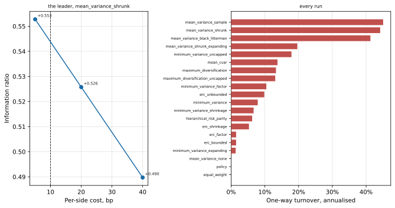
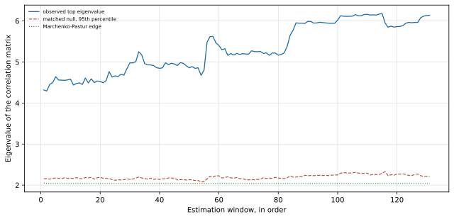

# The learning guide: how this comparison was built, and what it found

A learning exercise performed in role: a simulated mandate with no client and no institution. Nothing in this document is investment advice, a recommendation to any person, or a client communication, and the register is deliberate.

**Snapshot** `2026-09-13`, **build version** `1.2`, written from
20 pre-registered runs over 16 distinct cells, of which
131 out-of-sample months (2015-09 to 2026-07) are traded.

**Length** 7,160 words of prose, plus 3,918 words of printed comparison tables. The
design's band for the prose is 6,000 to 9,000 words, and the length is reported rather than asserted: a
drift past the band is visible in the run instead of enforced by a command.

*Generated from the code by `python3 -m reporting.guide`: every number below is read out of the same
run the comparison table, the findings memo and the decision record are read out of, so this document
cannot drift from the run it describes.*

## How to read this guide

The guide runs in eight parts, and they follow the order the work itself runs in rather than the order
of the questions it answers. The mandate and the problem come first, because a construction choice is
only a choice against a stated objective and a stated cost. The data comes second, with the terms of
each source, because those terms decide what may be published at all. The pipeline from source to panel
comes third, and it contains the single rule that most of the evaluation's credibility rests on. The
methods come fourth, layer by layer, each with its reason and the alternative it displaced. The results
come fifth, printed by the module that owns their structure. The reading of those results, their
resolution limits and what they do not establish, come sixth and seventh. The glossary closes the
document, and it defines every term the earlier parts use.

Three sibling documents carry the same exercise at other depths, and the guide names them rather than
repeating them. `reporting/findings-memo.md` answers the seven research questions one at a time and
publishes the negative results. `reporting/decision-record.md` is the one page a committee would sign,
with the conditions under which the recommendation would be withdrawn. `notebooks/` holds one executed
notebook per entry point, and each one runs its module in front of the reader, prints the module's own
report, and states what that module does not establish.

## 1. The mandate, the decision, and the cost of making it

The exercise begins with a portfolio that already exists. It holds eleven sleeves: developed, European
and Nordic equity; long and short government bonds; investment-grade and high-yield credit;
inflation-linked government bonds; gold; real estate; and a euro cash line. Each sleeve holds one
instrument, and the sleeves' weights are fixed strategic policy weights that sum to one, with equity at
30% through a developed-market tracker, government duration spread across long and short lines, and a
10% cash line. The weights are stated in the universe module rather than optimised, and that matters:
a benchmark whose own weights moved with the data would turn every tracking error into a moving target,
and the comparison needs a fixed object to measure against.

A mandate like that is reviewed at intervals, and the review asks one question. Would a different
construction method have produced a better book than the weights already held, after the trading the
method implies? The question sounds like a search for the best method, and it is not one. Across the
literature, the same families beat each other in different samples, which is what a reader should
expect when every family's inputs are estimated from the sample in question. What a committee can act
on is narrower and more useful: which of its choices moves the outcome on this mandate, by how much, on
which metric, and what the change costs to implement. That is the question this build answers, and it
answers it on one European multi-asset universe over 191 months of monthly bars, of
which the 131 from 2015-09 to 2026-07 are traded.

**The decision has two options and a price.** The committee can leave the book alone, in which case it
trades nothing and pays nothing, or it can adopt a constructed book, in which case it pays the
transaction cost of getting there and of staying there. Cost in this build is charged on *traded*
notional at 10 bp per side, so a rebalance is billed for what it moves rather
than for the size of the portfolio, and a method that trades rarely is not penalised for holding a
large book. The rate is a single declared number, and a sensitivity run reports the leader's
information ratio at 5 bp, 20 bp, 40 bp
per side so that a conclusion drawn only at the base rate is visible as such.

**The constraint set is part of the mandate, not a detail of the solver.** Every constructed book is
long-only, fully invested, capped at 35% per sleeve, and moved toward its target
through a no-trade band of 1% per sleeve with a 5% cap
on one-way turnover at each rebalance. Those four numbers do real work. A cap of
35% alone excludes the corners a maximum-Sharpe solution likes, the turnover cap
converts a continuous optimisation into a sequence of bounded trades, and the band means a target is
not always the book that gets held. Two of the sixteen cells lift the cap entirely, and they exist to
measure how much of a neighbouring cell's result the cap was producing rather than the objective.

**The risk budget is declared before anything is constructed.** The mandate states the share of
portfolio volatility each group is expected to consume: equity 55%,
government 20%, credit 15%, and
real assets with cash 10%. Declaring it in advance is what makes
the question "is the budget consumed by design or by accident?" measurable rather than rhetorical, and
the answer is reported against the signed benchmark as well as against the constructed books, so a
reader can see whether the mandate itself honours its own budget.

**Nothing here is advice, and the register is not a formality.** The exercise is performed in the role
of a portfolio constructor with no client and no institution behind the mandate, on a public data
snapshot. A study of this kind attracts almost none of the obligations that bind an authorised firm:
performance-claim standards such as GIPS reach a firm presenting track records to clients or prospects,
and conduct rules reach product design and distribution to clients. A private study has no client and no
prospect, so those obligations do not attach to it. What is not permitted is a claim the study cannot
support, and the stated purpose is exactly why every artifact carries the same sentence and why the
limitations sections are as long as they are. A reader who quotes a number from this repository should
quote the sentence beside it too.

## 2. Where the data comes from, and what each source permits

Three sources feed the panel, and the terms of the third one shape the whole publication.

**The risk-free leg is the European Central Bank's overnight rate chain.** No single euro overnight
series covers the panel's span, so the chain is spliced: EONIA before the euro short-term rate began,
the euro short-term rate after it, and the two joined at the later series' first observation. The two
series overlap for 579 days, and the overlap was measured rather than assumed, at +8.5 bp. The splice
matters because the join point is where a careless build produces a step in the cash return, and a step
in the cash leg is a step in every excess return in the panel. The Central Bank publishes the rate on
an *annualised* basis, so a month's accrual divides that rate by 360 and multiplies by the month's own
calendar days. Compounding it per period would overstate the cash leg, and the difference is a
systematic tilt against every risky sleeve rather than a rounding error.

**The factor legs come from the Fama/French archives.** The archive's monthly file carries the developed
market's own factor series, and two of its quirks are worth stating because both have produced wrong
numbers in published work: the momentum column is labelled WML rather than MOM, and the annual rows
follow the monthly ones in the same file, so a parser that ignores the header reads annual returns as
months. The archive's risk-free column is refused as a factor here, on the ground that it is the series
every excess return in the panel is already taken against.

**The sleeve prices come from a public price feed**, one series per fund, read as monthly bars with the
feed's adjusted close as the total-return proxy. The adjusted close is the only series the feed offers
that carries distributions, so it is the total-return proxy by necessity rather than by preference, and
a series whose adjusted close never diverges from its close is *refused* rather than patched. That
refusal cost the panel a sleeve that was wanted on investment grounds: the emerging-markets line is
dividend-blind, which means its series is a price series rather than a return series, and a price series
would have understated that sleeve's return by its distribution yield for the whole panel. The sleeve is
absent by decision rather than by oversight, and the same rule is why a second developed-market tracker
and a real-estate duplicate were dropped.

**What the terms of each source allow.** Central Bank statistics may be reused free of charge provided
the source is quoted and the series is not modified; any transformation has to be stated, and every
transformation this build applies is stated in the module that applies it. The Fama/French archives
carry a copyright line and no published licence, so they are used as research inputs and no factor
series is redistributed. The price feed is the binding constraint: its terms do not permit
redistribution, and that single fact decides the shape of everything this repository publishes. No price
series is shipped. Instead the snapshot stays on the machine it was fetched to, the workbook and the
figures carry derived statistics, and the figures are restricted to dispersions, shares, counts,
distributions and portfolio weights. The portfolio's own weight vector is not feed data at all; it is
this build's output, which is why a weight path may be drawn while a sleeve's price may not.

**The as-of rule is the data rule that matters most.** A month's bar is available only from the first
day of the *following* month. Every join in the package is gated by it, which is what stops an
estimation window built at the end of March from reading March's own return. Without the gate, a
walk-forward test reads the future by one month, and the error is nearly invisible: the weights stay
plausible, the returns look better rather than absurd, and nothing in a performance table reveals it.
The rule is stated as one predicate, `available_from <= when`, and the same predicate is what the SQL
twin of the contract uses, so the pandas path and the query cannot disagree about what was knowable.

**The snapshot is content-addressed.** The manifest records the instruments, the file hashes, the row
counts and each factor file's vintage, and the loader verifies all of it on every read and fails closed
when it does not match. A dataset that can change under a set of results cannot be the basis of a
comparison, and the manifest is what fixes the panel long enough to compare anything on it. Two runs are
the same run when they read the same snapshot and reproduce the same metric table within a stated
relative tolerance, and nothing weaker counts.

## 3. The pipeline: from a price bar to a monthly excess return

The package is a chain of small, separately runnable steps, and the chain matters because most of the
project's claims are properties of one link rather than of the whole.

**Fetch, once, outside the package.** The retrieval script is deliberately not part of the build. It
ran once, wrote the snapshot, and was retired, in the same way a reader fetching the data themselves
would do it by hand. Keeping it out of the package makes the dependency visible: the build consumes a
frozen snapshot, and a build that could re-fetch would silently stop being reproducible on the day the
feed changed.

**Verify, then parse, then gate.** The loader verifies the manifest, parses each leg into a long-format
table keyed by instrument and period, and runs the quality gate over the result. The gate is
8 stops and 4 warnings, each taken from the audit that selected the universe. A stop means the panel
is not the panel the results are keyed to and the loader raises; a warning means a number is usable but
qualified, and it prints beside the number it qualifies rather than in a footnote, because a
qualification a reader has to go looking for is a qualification that gets dropped. Among the stops are
the distribution-blind series and the impossible monthly move; among the warnings are the issuer facts
the fund wrapper's own rules make checkable, such as fund size and income policy.

**Join on the availability rule, then translate, then accrue.** The legs are joined under the as-of
predicate. Each sleeve's return is translated to euro as
`(1 + local) x (1 + translation) - 1`, so the currency effect is a term in the return rather than a
residual left over after it, and the cash rate is accrued over the month's own days at /360. The
difference between a sleeve's local return and its euro return is not a rounding difference on a
portfolio with a Swedish equity line and unhedged dollar exposure inside euro-quoted funds; it is a
return component in its own right, which is why the attribution later decomposes it explicitly.

**The result is the table contract.** One row per instrument-month, carrying `period_month` and
`available_from` beside the price and return columns. That contract is the interface a second project
would have to satisfy to consume this engine, and it is stated twice on purpose: once in pandas, which
is what the analytics run on, and once as a single SQL statement, which is checked against the pandas
path cell by cell on the frozen snapshot. The two agree exactly, and the stated tolerance of 1e-10
exists only because the two paths compound a month's rate in a different order. The reason to state the
contract twice is that a query can be read by someone who does not read Python, and a contract that
only one implementation states is a contract a reader has to infer.

**Then the two derived structures.** The factor layer builds a named spine from the published factor
legs and a constructed block from the sleeves' own income and credit lines. The risk layer estimates a
covariance per window from the panel's own returns. The construction layer turns means and covariances
into weight vectors under the mandate's constraints. Nothing downstream of the panel re-reads a raw
file, and nothing upstream estimates anything.

**What the chain is protecting.** Each step exists to make one class of error impossible rather than
unlikely. The manifest makes a changed dataset detectable. The gate makes an unusable series loud. The
as-of predicate makes look-ahead a property of the join rather than a discipline the author has to
remember. Parsing to a long table makes an instrument-month specific, so a missing bar is a missing row
rather than a silently shorter series. The panel runs 2010-09 to 2026-07,
191 months in all, and the traded window is the last 131 of them, from
2015-09 to 2026-07.

## 4. The method, layer by layer

The build is five layers deep, and each layer exists because the one below it left a question open. The
order below is the order they run in, and each subsection states what the layer does, why it is shaped
that way, and what was rejected.

### 4.1 The factor layer: describing what moves the sleeves

The eleven sleeves are funds, not firms, so the securities-level style and industry attributes a
commercial risk model would use are not available on this panel. What is available is a set of
published index legs and the sleeves' own construction. The build therefore carries two factor sets and
never confuses them.

The **named spine** is the Fama/French developed-market legs read from the archive. The **constructed
block** is built from the sleeves themselves: a government level, a term slope, a credit spread and a
high-yield excess, each assembled from declared combinations of the government and credit sleeves. The
block's arithmetic is deliberately trivial. A load of one on the government level is the sleeve's own
construction rather than an estimated sensitivity, and that is the point: the block gives the
decomposition exact identities to land on, which is what makes the four construction sleeves checkable
rather than merely fitted.

Tracking error is then split per window by an ordinary least squares regression of each sleeve's euro
excess return on the two sets, refitted monthly on a 60-month trailing window. Four
sleeves in the panel are exact linear combinations of the block, so regressing them on a set containing
their own construction would fit them exactly and report every other loading as zero. Those four are
therefore regressed on the spine alone, with the block part reported as the identity it is, and no alpha
is reported for them: their full-model alpha is zero by arithmetic rather than by evidence, which is
exactly why reporting it would be misleading. The first window carries 59 observations
rather than 60, because the panel's first bar has no return to estimate from.

Two diagnostics travel with the regression, and both are about the collinearity inside the block. The
block's own series move together strongly, so the build **orthogonalises the block against itself**
inside each window in a declared order, which is what makes each later loading the clean reading. The
variance inflation factor is reported beside the loadings, because a coefficient whose variance is
inflated by orders of magnitude is not a coefficient a reader should quote. Nothing is centred: a
monthly factor return's mean belongs to the factor model, and centring would move the intercept and turn
the reported alpha from a Jensen measure into the sleeve's own average return.

The **statistical family** is principal components extracted from the correlation matrix of the sleeves'
returns. Two properties of that choice need stating precisely, because both are routinely overstated.
Principal components extract directions of common variation; they do not select factors, and they do not
identify which directions are priced. The selection problem needs an external criterion, and this build
supplies one before looking at any output: a component is retained when its eigenvalue beats the 95th
percentile of a **matched empirical null** built by permuting each series independently, which destroys
the cross-sectional alignment and preserves each series' own distribution. The alternative was an
analytic line. The Marchenko-Pastur edge for eleven series over sixty months sits between
2.0397 and 2.0500 across the windows, and the
rule retains 2 components, with per-window counts across the out-of-sample window
taking the values [1, 2]. Kaiser's eigenvalue-above-one
rule would have retained a different and larger number here, which is the honest reason to prefer the
matched null: a rule of thumb that answers a different question does not become right by being popular.
The rule also carries its own falsification check, which does not fire on this panel, and a stability
check that re-decides the count on independently permuted windows.

**Spanning** asks whether one factor set is needed once the other is present, and it is run in both
directions. The regression form follows Huberman and Kandel (1987, *Journal of Finance* 42(4)), the
statistic is Gibbons, Ross and Shanken (1989, *Econometrica* 57(5)), and both sets reject being spanned
by the other on this panel. The direction that matters downstream is that the named spine carries
something the constructed block does not, which is why the block is reported beside the spine rather
than replacing it. A Fama-MacBeth two-pass estimate is also computed and is reported as *unsupported*
at this panel's size rather than presented as a result; the errors-in-variables problem in a second-pass
premium is not something eleven funds over 131 traded months can settle, and a small panel does not
become sufficient by producing a number.

### 4.2 The risk layer: three covariances, and what the axis actually measures

The risk-model axis puts three estimators of one object behind one interface: the **sample covariance**,
**linear shrinkage** toward a structured target at an intensity the estimator estimates from the window
(Ledoit and Wolf, 2004, *Journal of Multivariate Analysis* 88(2)), and the **factor-model covariance**
`B F B' + D` built from the retained component structure, which is why the risk layer depends on the
factor layer.

The axis is easy to misread, so the build states its limit beside it. What varies here is the
*conditioning* of the matrix handed to the optimiser, and what that measures is the optimiser's
numerical behaviour rather than which estimator is more accurate. There is no true covariance to compare
against on this panel, and a sample covariance is by construction the best fit to its own window, so an
in-sample accuracy ranking would rank whichever estimator it was computed from first. At sixty months and
eleven sleeves, a sample covariance's condition number is large enough that the optimiser is far more
the object under test than the estimator is, which is why each estimator prints its condition number and
the shrinkage prints the intensity it chose. The dispersion this axis produces is therefore a floor on
what a differently structured risk model would produce, and the comparison says so instead of implying
that the axis settles a modelling question.

### 4.3 The construction layer: four mean inputs, eight objectives, one constraint set

Construction is where a covariance and a mean become a weight vector, and the build separates the two
inputs so that each can be varied alone.

**The mean input.** Every input returns one mean vector over the sleeves and is consumed by a
constructor that never learns which input produced it, which is what makes the axis an input choice
rather than a code path. Four inputs are declared: the **sample mean**; **Bayes-Stein shrinkage** toward
the minimum-variance implied mean with the intensity estimated from the window (Jorion, 1986, *Journal
of Financial and Quantitative Analysis* 21(3)); the **Black-Litterman posterior** (Black and Litterman,
1992, *Financial Analysts Journal* 48(5), in the form Walters derives), whose prior is the returns
implied by the mandate's own policy weights and whose view is the window's sample mean; and **no mean at
all**, where the estimator is dropped and the constraint set decides the book. The no-mean cell is the
control, and it is the reason the mean axis can be read at all: it isolates how much of each other cell's
result the solver and the constraints were producing on their own.

Black-Litterman needs the prior's scaling and the view's uncertainty, and the build fixes the convention
rather than leaving it implicit: the prior's scaling is one over the observation count and the view's
uncertainty is the same factor, so the count cancels and the posterior depends only on the ratio between
how much the prior is trusted and how much the view is. A consequence worth stating is that the
sensitivity which matters is that ratio, not the confidence level, and the cell reports its ratio run
beside its base case for exactly that reason.

**The objectives.** Each family answers a different question about the same covariance: minimum variance
asks which book has the smallest variance; maximum diversification asks which maximises the ratio of the
weighted average volatility to the portfolio's own (Choueifaty and Coignard, 2008, *Journal of Portfolio
Management* 35(1)); equal risk contribution asks which makes every sleeve's contribution to volatility
equal (Maillard, Roncalli and Teiletche, 2010, *Journal of Portfolio Management* 36(4)); hierarchical
risk parity asks which allocates by a recursive bisection of a clustered correlation matrix (López de
Prado, 2016, *Journal of Portfolio Management* 42(4)); mean-CVaR asks which minimises the average loss in
the tail of its own window, as a linear programme (Rockafellar and Uryasev, 2000, *Journal of Risk*
2(3)); and constrained mean-variance asks the classic question at a stated risk-aversion weight
(Markowitz, 1952, *Journal of Finance* 7(1)). The minimum-variance closed form against reciprocal
variances, due to Clarke, de Silva and Thorley (2006, *Journal of Portfolio Management* 33(1)), is what
the hand-checked identity case in the test suite uses, because it is a case a reader can verify on paper.

**The constraint set.** Every book is long-only, fully invested, capped at 35% per
sleeve, with a 5% turnover cap and a 1% no-trade band.
The projection that enforces the cap is worth one sentence because the obvious implementation is wrong
twice over: clipping a weight vector and renormalising can push a sleeve back over the cap and leaves the
vector summing to something other than one. The build solves the constrained problem instead, by
clipping, redistributing the excess among the sleeves still below the cap, and repeating until nothing
is left. A book whose cap binds is reported as such, because a cell that stops being the method it is
named after is a result about the constraint set rather than about the method.

**Cost.** Charged on traded notional at 10 bp per side, which is twice the one-way
turnover. Writing the rate beside the one-way figure instead halves every cost in the project, and the
convention is stated in the module that applies it for that reason. The establishment cost, the trade
that builds the book at the start of the window, is reported as its own line outside the window and
outside the cap rather than amortised into the performance, so a reader can see what starting cost.

### 4.4 The evaluation layer: how a difference is made claimable

This is the layer that decides whether anything above it can be said at all, and its central choice is
forced by a power calculation. A single strategy's annualised Sharpe ratio over 131 months carries a
standard error near 0.30 and therefore a 95% interval of roughly ±0.59 (Sharpe, 1994, *Journal of
Portfolio Management* 21(1), is the source of the ratio's definition). An interval that wide cannot
separate two methods: nearly every method sits inside every other's interval. **Every comparison is
therefore a paired test on the difference of the two monthly return series**, which is legitimate only
because the cells are highly correlated with one another, sharing a universe, a set of months and
long-only books. The paired standard error at the realised correlation is much smaller, and the
smallest difference the design detects at 80% power is of the order of 0.36 in information-ratio terms:
that is the bar the row decided at plus the power quantile times the standard error, and it is what gets
printed beside every verdict of "no difference detected". It is the difference between a finding and an
absence of one, and it is quoted at the bar that decided the row rather than at the nominal five percent,
which would print a figure a third smaller and describe a test the row was not decided by.

The engine walks forward. Each cell is estimated on a rolling 60 months, refitted
monthly, and trades only inside the window: an estimate formed at the close of a month never reads the
following month's bar. Two cells are also run on an **expanding** window, where each estimate uses every
month since the panel opened, so a result that depends on the arbitrary length of a sixty-month window is
visible as such. A planted look-ahead break is caught by a test rather than trusted to review.

The **metric block** is deliberately small. The information ratio and tracking error against the policy
benchmark are primary; volatility, drawdown, turnover, concentration, the weight-path movement and the
constraint-binding frequency are reported beside them. The information ratio is primary because the
mandate is benchmarked and because an active decision is judged on the risk it takes away from the
benchmark, not on its own volatility. The Sharpe ratio is what was measured, then set aside.

**Four verdicts, one ladder, and two of its rungs ask different questions.** A cell is called different
only when it clears the family-wise bar at
`|z| >= 2.9552`, keeps the sign of its own advantage in at least
80% of 2000 bootstrap resamples of its monthly
returns, and holds that sign under the expanding protocol. Failing any rung produces one of: no difference
detected, a declared negative result where the book reproduces equal weight, or a statement that the
expanding leg was not run for that cell. The resampling contributes two statistics and they are not
interchangeable: a cell's own sign retention asks whether its advantage over the benchmark is measured,
and the leader's **rank retention** asks whether one cell is uniquely best among the cells. A leader that
passes the first and fails the second is refused a recommendation, because the design requires every rung,
and its row is worded as a ranking that was not resolved rather than as an advantage that was not found.
Sixteen cells tested against two families imply a bar well past the nominal five percent, and that is the
point: testing this many methods against one universe and reporting the winner is how research finds
differences that do not exist. The bar used is
`|z| >= 2.9552`, the Bonferroni-equivalent value over the declared cells; the realised
correlation implies 5.3 effective tests, at which the bar would be
2.5758, and the conservative of the two is the one applied. The correction is
self-imposed from the literature (Harvey, Liu and Zhu, 2016, *Review of Financial Studies* 29(1)); no
located regulation requires it, and the documents say so rather than borrowing authority for a choice.

### 4.5 The attribution layer: two readings of the same active return

Attribution explains the active return, and this build uses Brinson and Fachler's holding-based
decomposition (1985, *Journal of Portfolio Management* 11(3)), with Brinson, Hood and Beebower (1986,
*Financial Analysts Journal* 42(4)) appearing only inside the hand-verified case. The decomposition here
is **allocation-only**, and the reason is structural rather than a simplification: the policy benchmark
holds the same instrument in each sleeve, so the selection term does not exist. Printing a zero column
would read as a market finding, so the workbook states the term's absence with its reason. The currency
dimension carries the interaction instead. A sleeve's euro return decomposes along the local return and
the translation, and measuring allocation on local-currency returns while also adding a currency line
would count the translation twice, so the interaction is named as its own line.

A single-period effect cannot be summed across months to give a multi-period excess, so the effects are
linked. The reported link is Cariño's, with Menchero's single constant plus a period adjustment as the
cross-check, and the agreement between the two is what makes the linked number a claim rather than a
choice. The residual after linking is reported rather than absorbed, so a reader can see how much of the
answer the link itself is carrying. The **factor view** reads the same active return through the fitted
exposures, and the two views are printed side by side and never summed: they decompose the same series in
different bases, and adding them would double-count the return. Their cross-view residual is zero by
construction and fires only when one view is reading a different month set, which makes it a definition
check rather than a modelling error.

### 4.6 The risk-budget layer: where the risk actually went

The budget asks whether the volatility the mandate declared is the volatility the books deliver. The
decomposition is **Euler's**, applied to a risk measure homogeneous of degree one: each sleeve's
contribution is `w_i d(sigma)/d(w_i)` in percentage of volatility, and additivity is checked numerically
on every run rather than assumed. Contributions are aggregated into the mandate's four declared groups
and read against the declared vector, on both the policy book and the constructed books.

One measure is refused, and the refusal is measured rather than asserted. **Value at risk** is not a
coherent risk measure: its conditional contributions do not sum to it, so presenting them as a
decomposition reports parts that do not make the whole (Artzner, Delbaen, Eber and Heath, 1999,
*Mathematical Finance* 9(3)). The build demonstrates the failure on its own panel and the expected
shortfall, which is homogeneous of degree one, is decomposed in its place. The covariance the budget is
read against is held fixed across the run rather than re-estimated monthly, because a moving covariance
would make the consumption and the declared target two moving objects that never meet; what moves is the
book, which is the object under test.

### 4.7 The comparison grid: everything declared before anything runs

The grid is where the comparison is made checkable. 16 distinct cells and
20 pre-registered runs are declared in the registry, with the axes laid out so that one
thing moves at a time: stage A varies the construction family at one covariance and one default mean,
stage B varies the covariance estimator across the two most covariance-dependent families, and stage C
varies the mean input inside mean-variance. Two perturbation runs lift the per-sleeve cap and nothing
else, and two repeats re-run the cells the mandate's question turns on under the expanding protocol.
The count is fixed in the code before any of them runs, and a run added later is an amendment with a date
rather than a row that appeared in a table. Without that, a search over sixteen methods whose size is
reported after the results are seen is a search whose size was chosen by the results.

The stage-A family cells span a tracking error from 4.16% to 7.14% a year and an information
ratio from -0.764 to +0.544, and the stage-B risk-model cells span a tracking error from
4.40% to 6.15%. Those ranges are the raw material of the results, and the reading of them
is the next part's subject.

## 5. The results

The table below is the comparison module's own rendering of the two stacked blocks, produced by the same
code that prints it at the command line and writes it into the workbook. It is not transcribed here, and
that is the point of generating this document.

### returns and risk

**the pre-registered runs**

| cell | st | IR | vol/yr | TE/yr | z vs pol | res | ret | expand | verdict |
| :--- | ---: | ---: | ---: | ---: | ---: | ---: | ---: | ---: | ---: |
| equal_weight | A | -0.573 | 6.59% | 1.71% | -8.86 | 0.25 | 98% | - | the equal-weight bar itself |
| policy | A | 0.000 | 7.43% | 0.00% | 0.00 | 0.00 | 0% | - | the policy benchmark itself |
| mean_variance_shrunk | A | 0.544 | 10.41% | 4.91% | 4.05 | 0.51 | 96% | yes | the advantage clears every bar, and no cell is uniquely best: the leader's rank is not retained in bootstrap resamples |
| minimum_variance | A | -0.764 | 1.60% | 6.23% | -3.97 | 0.73 | 99% | yes | significantly behind the benchmark once the cost is charged |
| maximum_diversification | A | -0.556 | 2.49% | 5.64% | -2.90 | 0.73 | 96% | - | no difference detected |
| erc_unbounded | A | -0.747 | 0.39% | 7.14% | -3.42 | 0.83 | 99% | - | significantly behind the benchmark once the cost is charged |
| erc_bounded | A | -0.728 | 2.17% | 5.48% | -6.30 | 0.44 | 99% | - | significantly behind the benchmark once the cost is charged |
| hierarchical_risk_parity | A | -0.722 | 3.61% | 4.16% | -7.51 | 0.37 | 99% | - | significantly behind the benchmark once the cost is charged |
| mean_cvar | A | -0.659 | 2.02% | 6.28% | -2.64 | 0.95 | 98% | - | no difference detected |
| minimum_variance_shrinkage | B | -0.737 | 1.78% | 6.03% | -4.21 | 0.66 | 99% | - | significantly behind the benchmark once the cost is charged |
| minimum_variance_factor | B | -0.791 | 1.63% | 6.15% | -4.43 | 0.68 | 99% | - | significantly behind the benchmark once the cost is charged |
| erc_shrinkage | B | -0.709 | 3.39% | 4.40% | -6.78 | 0.40 | 99% | - | significantly behind the benchmark once the cost is charged |
| erc_factor | B | -0.734 | 2.18% | 5.47% | -6.40 | 0.44 | 99% | - | significantly behind the benchmark once the cost is charged |
| mean_variance_sample | C | 0.517 | 10.57% | 4.98% | 3.91 | 0.50 | 95% | - | different on the paired test; the expanding leg was not run for this cell |
| mean_variance_black_litterman | C | 0.392 | 11.70% | 5.57% | 3.37 | 0.44 | 90% | - | different on the paired test; the expanding leg was not run for this cell |
| mean_variance_none | C | -0.573 | 6.59% | 1.71% | -8.86 | 0.25 | 98% | - | negative result: the book reproduces equal weight |
| minimum_variance_uncapped | A | -0.746 | 0.18% | 7.39% | -1.96 | 1.45 | -- | - | no difference detected |
| maximum_diversification_uncapped | A | -0.736 | 0.29% | 7.27% | -2.62 | 1.07 | -- | - | no difference detected |
| mean_variance_shrunk_expanding | A | 0.506 | 12.66% | 6.32% | 4.58 | 0.42 | -- | - | the expanding repeat of the rolling cell |
| minimum_variance_expanding | A | -0.818 | 1.55% | 6.20% | -4.66 | 0.67 | -- | - | the expanding repeat of the rolling cell |

**the cells published as negative results, each also carrying its verdict above**

| cell | verdict |
| :--- | ---: |
| mean_variance_shrunk | the advantage clears every bar, and no cell is uniquely best: the leader's rank is not retained in bootstrap resamples |
| maximum_diversification | no difference detected |
| mean_cvar | no difference detected |
| mean_variance_none | negative result: the book reproduces equal weight |
| minimum_variance_uncapped | no difference detected |
| maximum_diversification_uncapped | no difference detected |

**the realised correlation of the cells' monthly returns, descriptive and untested; rows and columns are in the same order as the runs above, and the workbook carries the names**

| equal_weight | 1.00 | 0.98 | 0.91 | 0.85 | 0.87 | 0.77 | 0.97 | 0.97 | 0.73 | 0.89 | 0.88 | 0.98 | 0.97 | 0.91 | 0.92 | 1.00 |
| policy | 0.98 | 1.00 | 0.90 | 0.80 | 0.80 | 0.74 | 0.93 | 0.95 | 0.66 | 0.83 | 0.83 | 0.94 | 0.93 | 0.90 | 0.93 | 0.98 |
| mean_variance_shrunk | 0.91 | 0.90 | 1.00 | 0.75 | 0.82 | 0.69 | 0.88 | 0.91 | 0.75 | 0.79 | 0.76 | 0.90 | 0.89 | 1.00 | 0.95 | 0.91 |
| minimum_variance | 0.85 | 0.80 | 0.75 | 1.00 | 0.90 | 0.81 | 0.94 | 0.82 | 0.90 | 0.97 | 0.99 | 0.91 | 0.94 | 0.75 | 0.69 | 0.85 |
| maximum_diversification | 0.87 | 0.80 | 0.82 | 0.90 | 1.00 | 0.77 | 0.94 | 0.84 | 0.91 | 0.93 | 0.89 | 0.92 | 0.94 | 0.82 | 0.74 | 0.87 |
| erc_unbounded | 0.77 | 0.74 | 0.69 | 0.81 | 0.77 | 1.00 | 0.82 | 0.68 | 0.75 | 0.77 | 0.79 | 0.76 | 0.82 | 0.69 | 0.69 | 0.77 |
| erc_bounded | 0.97 | 0.93 | 0.88 | 0.94 | 0.94 | 0.82 | 1.00 | 0.94 | 0.86 | 0.97 | 0.95 | 0.99 | 1.00 | 0.88 | 0.85 | 0.97 |
| hierarchical_risk_parity | 0.97 | 0.95 | 0.91 | 0.82 | 0.84 | 0.68 | 0.94 | 1.00 | 0.72 | 0.88 | 0.85 | 0.96 | 0.95 | 0.91 | 0.89 | 0.97 |
| mean_cvar | 0.73 | 0.66 | 0.75 | 0.90 | 0.91 | 0.75 | 0.86 | 0.72 | 1.00 | 0.89 | 0.87 | 0.82 | 0.85 | 0.75 | 0.62 | 0.73 |
| minimum_variance_shrinkage | 0.89 | 0.83 | 0.79 | 0.97 | 0.93 | 0.77 | 0.97 | 0.88 | 0.89 | 1.00 | 0.97 | 0.95 | 0.96 | 0.79 | 0.73 | 0.89 |
| minimum_variance_factor | 0.88 | 0.83 | 0.76 | 0.99 | 0.89 | 0.79 | 0.95 | 0.85 | 0.87 | 0.97 | 1.00 | 0.92 | 0.94 | 0.76 | 0.71 | 0.88 |
| erc_shrinkage | 0.98 | 0.94 | 0.90 | 0.91 | 0.92 | 0.76 | 0.99 | 0.96 | 0.82 | 0.95 | 0.92 | 1.00 | 0.99 | 0.90 | 0.88 | 0.98 |
| erc_factor | 0.97 | 0.93 | 0.89 | 0.94 | 0.94 | 0.82 | 1.00 | 0.95 | 0.85 | 0.96 | 0.94 | 0.99 | 1.00 | 0.89 | 0.86 | 0.97 |
| mean_variance_sample | 0.91 | 0.90 | 1.00 | 0.75 | 0.82 | 0.69 | 0.88 | 0.91 | 0.75 | 0.79 | 0.76 | 0.90 | 0.89 | 1.00 | 0.95 | 0.91 |
| mean_variance_black_litterman | 0.92 | 0.93 | 0.95 | 0.69 | 0.74 | 0.69 | 0.85 | 0.89 | 0.62 | 0.73 | 0.71 | 0.88 | 0.86 | 0.95 | 1.00 | 0.92 |
| mean_variance_none | 1.00 | 0.98 | 0.91 | 0.85 | 0.87 | 0.77 | 0.97 | 0.97 | 0.73 | 0.89 | 0.88 | 0.98 | 0.97 | 0.91 | 0.92 | 1.00 |

**sub-periods fixed by calendar, descriptive only: never the headline, never the basis of a recommendation**

| cell | zero_rate | dislocation | inflation_shock | recent |
| :--- | ---: | ---: | ---: | ---: |
| equal_weight | -0.778 | -1.006 | 0.162 | -0.532 |
| policy | 0.000 | 0.000 | 0.000 | 0.000 |
| mean_variance_shrunk | 0.266 | -0.082 | 0.691 | 1.329 |
| minimum_variance | -1.117 | -1.133 | 0.090 | -0.895 |
| maximum_diversification | -1.052 | -0.924 | 0.199 | -0.376 |
| erc_unbounded | -1.200 | -1.042 | 0.179 | -1.029 |
| erc_bounded | -1.142 | -1.106 | 0.158 | -0.837 |
| hierarchical_risk_parity | -1.121 | -1.519 | 0.218 | -0.993 |
| mean_cvar | -1.126 | -1.124 | 0.131 | -0.486 |
| minimum_variance_shrinkage | -1.093 | -1.151 | 0.127 | -0.864 |
| minimum_variance_factor | -1.124 | -1.182 | 0.070 | -0.942 |
| erc_shrinkage | -1.101 | -1.028 | 0.056 | -0.753 |
| erc_factor | -1.146 | -1.110 | 0.155 | -0.855 |
| mean_variance_sample | 0.262 | -0.138 | 0.646 | 1.317 |
| mean_variance_black_litterman | 0.130 | 1.020 | 0.216 | 0.458 |
| mean_variance_none | -0.778 | -1.006 | 0.162 | -0.532 |
| minimum_variance_uncapped | -1.208 | -1.053 | 0.178 | -1.016 |
| maximum_diversification_uncapped | -1.199 | -1.054 | 0.184 | -0.984 |
| mean_variance_shrunk_expanding | 0.318 | 0.740 | 0.134 | 0.883 |
| minimum_variance_expanding | -1.119 | -1.132 | 0.069 | -1.107 |

**Notes to this block.**

- two testing families only: every cell against the policy benchmark, and every cell against equal weight; the 120-pair cell matrix above is descriptive and never tested

- res is the smallest information-ratio difference this test would have detected at eighty percent power; every 'no difference detected' is qualified by it rather than left to read as an absence

- the leader on the full sample is mean_variance_shrunk, retaining rank in 67.5% of resamples against a floor of 80%; ret is each cell's own share of resamples in which its advantage keeps its sign

- the multiple-testing haircut is self-imposed from the literature and not a regulatory requirement: nothing located imposes a multiple-testing correction on portfolio research

- no row cleared every rung, so no recommendation is claimed on this run

### cost and diagnostics

**estimation-error diagnostics and the cost, beside the verdicts they qualify; the median target-path movement across the runs is 0.91% against 0.00% for a fixed-weight book**

| cell | movement | concentration | concentration traded | largest weight | largest traded | turnover/yr | cost/yr | cap binding | drawdown |
| :--- | ---: | ---: | ---: | ---: | ---: | ---: | ---: | ---: | ---: |
| equal_weight | 0.00% | 11.00 | 11.00 | 0.091 | 0.091 | 0.00% | 0.00% | 0.00 | -12.13% |
| policy | 0.00% | 6.67 | 6.67 | 0.300 | 0.300 | 0.00% | 0.00% | 0.00 | -13.11% |
| mean_variance_shrunk | 6.91% | 3.01 | 3.36 | 0.350 | 0.350 | 44.18% | 0.09% | 0.19 | -15.37% |
| minimum_variance | 0.76% | 3.23 | 3.33 | 0.350 | 0.350 | 7.89% | 0.02% | 0.05 | -4.98% |
| maximum_diversification | 1.38% | 3.69 | 3.85 | 0.350 | 0.350 | 13.29% | 0.03% | 0.15 | -4.45% |
| erc_unbounded | 1.29% | 1.79 | 1.79 | 0.930 | 0.930 | 9.83% | 0.02% | 0.00 | -1.51% |
| erc_bounded | 0.27% | 3.88 | 4.01 | 0.350 | 0.350 | 1.48% | 0.00% | 0.23 | -4.49% |
| hierarchical_risk_parity | 0.59% | 5.09 | 5.23 | 0.350 | 0.350 | 6.23% | 0.01% | 0.18 | -7.18% |
| mean_cvar | 1.28% | 3.38 | 3.51 | 0.350 | 0.350 | 13.75% | 0.03% | 0.15 | -4.37% |
| minimum_variance_shrinkage | 0.83% | 3.80 | 3.92 | 0.350 | 0.346 | 6.67% | 0.01% | 0.00 | -3.93% |
| minimum_variance_factor | 0.91% | 3.22 | 3.35 | 0.350 | 0.350 | 10.44% | 0.02% | 0.05 | -5.27% |
| erc_shrinkage | 0.73% | 6.29 | 6.39 | 0.321 | 0.316 | 5.29% | 0.01% | 0.00 | -7.19% |
| erc_factor | 0.33% | 3.88 | 4.01 | 0.350 | 0.350 | 1.49% | 0.00% | 0.23 | -4.52% |
| mean_variance_sample | 6.68% | 3.00 | 3.35 | 0.350 | 0.350 | 45.06% | 0.09% | 0.56 | -16.26% |
| mean_variance_black_litterman | 7.86% | 3.00 | 3.35 | 0.350 | 0.350 | 41.28% | 0.08% | 0.26 | -17.19% |
| mean_variance_none | 0.00% | 11.00 | 11.00 | 0.091 | 0.091 | 0.00% | 0.00% | 0.00 | -12.13% |
| minimum_variance_uncapped | 3.34% | 1.47 | 1.45 | 1.000 | 0.999 | 17.89% | 0.04% | 0.00 | -2.16% |
| maximum_diversification_uncapped | 1.46% | 1.40 | 1.40 | 0.992 | 0.988 | 13.08% | 0.03% | 0.00 | -1.62% |
| mean_variance_shrunk_expanding | 3.19% | 3.04 | 3.12 | 0.350 | 0.350 | 19.63% | 0.04% | 0.92 | -21.07% |
| minimum_variance_expanding | 0.19% | 3.23 | 3.33 | 0.350 | 0.350 | 1.34% | 0.00% | 0.06 | -5.00% |

**the cost sensitivity, information ratio at each per-side multiple beside the decided one; the ranking's survival at the top multiple is a separate statement from the level at the base**

| cell | 5 bp | 20 bp | 40 bp |
| :--- | ---: | ---: | ---: |
| equal_weight | -0.573 | -0.573 | -0.573 |
| policy | 0.000 | 0.000 | 0.000 |
| mean_variance_shrunk | 0.553 | 0.526 | 0.490 |
| minimum_variance | -0.763 | -0.767 | -0.772 |
| maximum_diversification | -0.553 | -0.560 | -0.570 |
| erc_unbounded | -0.745 | -0.750 | -0.755 |
| erc_bounded | -0.728 | -0.729 | -0.730 |
| hierarchical_risk_parity | -0.721 | -0.725 | -0.731 |
| mean_cvar | -0.656 | -0.663 | -0.671 |
| minimum_variance_shrinkage | -0.736 | -0.739 | -0.743 |
| minimum_variance_factor | -0.789 | -0.795 | -0.802 |
| erc_shrinkage | -0.708 | -0.712 | -0.716 |
| erc_factor | -0.734 | -0.735 | -0.736 |
| mean_variance_sample | 0.526 | 0.499 | 0.462 |
| mean_variance_black_litterman | 0.399 | 0.377 | 0.348 |
| mean_variance_none | -0.573 | -0.573 | -0.573 |
| minimum_variance_uncapped | -0.744 | -0.751 | -0.761 |
| maximum_diversification_uncapped | -0.735 | -0.740 | -0.747 |
| mean_variance_shrunk_expanding | 0.509 | 0.500 | 0.488 |
| minimum_variance_expanding | -0.818 | -0.819 | -0.820 |

*Every cell's tracking error against its information ratio.*

*The leader's information ratio against the per-side cost multiple, beside every run's turnover.*

*Realised volatility contributions against the declared budget.*

*Each run's share of bootstrap resamples in which it leads, against the floor.*

*The observed top eigenvalue against the matched null and the Marchenko-Pastur edge.*

## 6. Reading the results, and what they do not say

Four statements can be made from this table, and each one is bounded.

**The families differ, and they differ most in the risk they take away from the benchmark.** The stage-A
cells span a tracking error of several percentage points a year, and the dispersion is large relative to
the test's resolution, which is what makes the family the axis that matters most on this panel. The
metric the question turns on is therefore tracking error rather than return: what separates these
families is how much risk they take away from the benchmark, and a family that takes more away is not
thereby better.

**The direction cuts both ways.** 8 cells that differ from the policy benchmark on the paired
test sit significantly *behind* it once cost is charged, and the cells that sit significantly *ahead* of it
are the ones carrying a mean input. The first is a statement about cost and about the benchmark rather
than about the methods being poor: the policy book is a reasonable diversified book, and the bar it sets
is a real one.

**The sample's leader has an advantage the resampling keeps and a rank it does not.** The best
information ratio on the full sample is `mean_variance_shrunk` at +0.544. It keeps the
sign of that advantage in 95.9% of 2000 resamples, above the
80% floor declared in advance, and holds it under the expanding
protocol; it keeps its **rank** ahead of the other cells in 67.5% of the
same resamples, below that floor. Its target path moves 6.91% a month,
which is among the largest movements in the table and is the honest signature of a method leaning on its
estimates. These are two different findings. The advantage is measured and the ordering of the near-tied
cells is not, and a reader who takes the second for the first has read a ranking as an absence.

**The risk budget is consumed by accident rather than by design.** The realised group contributions are
reported against the declared vector for the policy book and the leader, and the largest departure on the
policy book is equity. A risk-based family concentrates volatility wherever the covariance puts it, which
is not where a mandate's declared vector puts it, and no cell's objective mentioned the budget. That is
the honest reading of the budget question, and it is the reason the vector is declared in the data layer
rather than inferred afterwards.

Five limits bound all of it. The **resolution limit** on a typical row is printed beside that row, and a
verdict of "no difference detected" means the difference is smaller than the panel can resolve, not that
the two methods are equivalent. **6** of the 16 distinct cells carry
such a verdict or a declared negative result, and they are published as results rather than dropped.
**One panel** of 191 months, 20 runs and one mandate fixes the scope: a
difference this design cannot resolve is not reported as an absence, and a difference it does resolve is
a statement about this universe rather than about construction in general. **Estimation error is visible
and not modelled away**: the weight-stability diagnostic is reported for every cell, and the mean-variance
family's own error is in the mean, which is why the shrinkage cell exists to show how much of it a
standard remedy removes rather than to claim the remedy. **The residuals are named**: the attribution
reconciles to 2e-14 relative, the Euler contributions add to 4e-16 relative
on every run, and the factor model's unexplained part is reported as its own measured quantity. Nothing
in the table is a forecast, and no cell's row supports a claim about a live book.

**Four separate statements are easy to confuse, and the documents keep them apart.** A cell can differ
from the benchmark, a family of cells can differ from it, a cell can be the sample's leader, and a cell
can be worth adopting. The first two are test results, the third is a rank, and the fourth requires the
first to survive every rung of the ladder and the cost of the change to be worth paying. On this panel
nothing reaches the fourth, so the record nominates no cell; the second is what its recommendation rests
on, and the gap between the second and the fourth is the reason the ladder and the axis are reported side
by side.

## 7. The conclusion, in the committee's terms

**Move the objective to a mean-input mean-variance construction, and do not claim a variant.** No cell
cleared every rung of the declared ladder: the leader cleared the family-wise bar, kept the sign of its own
advantage in 95.9% of resamples and held it under the expanding protocol, and failed the rung that asks
whether one cell is uniquely best (67.5% against the
80% floor). The ladder names no cell, and the record does not either.
What the same table supports is the axis those cells share: all 3 of the cells carrying a
mean input clear the family-wise bar on their own row, keeping the sign of the advantage in 96%, 95%, 90% of
resamples, while the cell that carries no mean clears nothing and returns
-0.573. The construction is recommended and the variant
is not, because the leading two sit 0.027 apart on the information ratio against a resolution of
0.51 on the leading row.

The practical value runs in three directions. For the mandate, the decision is a partial tilt rather than a
replacement: the family trades 41.3% to 45.1% a year and costs 0.08% to 0.09% of return a year, which its advantage
survives, and the tilt is sized so that the mandate's volatility and its declared risk budget stay where
the mandate put them. For the method, the exercise quantifies how much of a methodological choice survives
when cost, multiple testing and resampling are charged against it, and it keeps apart the two questions
resampling can answer - whether an advantage is measured, and whether a ranking is - which is a more
useful quantity than a ranking of in-sample fits. For the reader, the artifacts are a
worked example of the whole chain, from a licensed data source through a look-ahead-free panel, a
documented risk model, constrained construction, a paired out-of-sample evaluation and two
decompositions, with every number traceable to the module that computed it.

**Six conditions would reopen the decision**, and they are stated in the record rather than implied. A
rerun that no longer reproduces the metric table within the stated tolerance invalidates the exercise. The
cells carrying a mean losing the bar or the sign of their advantage, on this snapshot or a longer panel,
withdraws the recommendation, because it rests on those rows. The cap binding far enough to make the
result one about the constraint set would do the same, which the perturbation runs already exist to
measure. So would a decision to treat the declared risk budget as a constraint rather than a report and a
mean-input book that cannot then be sized to the mandate's volatility. A cell that clears the bar, keeps
the sign of its own advantage in at least 80% of resamples, holds that
sign under the expanding protocol and keeps its rank in at least
80% of the same resamples becomes a candidate, and the record would
then name it rather than the axis. And a longer panel on which a difference absent here remains absent
while the resolution limit falls below it would turn an absence into evidence, so the risk-based families
would have to be reread. The recommendation is withdrawn or revisited when one of those holds, and not
before.

**The scope stays stated.** One panel, 11 sleeves, 191 months of
which 131 are traded, one mandate and one currency. The exercise is a simulation performed in
role, with no client and no institution, and nothing here is investment advice or a client communication.
A reader who takes one of these numbers should take its resolution limit with it, and a reader who takes
the recommendation should take the six conditions with it.

## 8. The concepts, in one place

Every term the guide uses, defined in plain words, with where it is used and where it comes from. `own` marks a quantity or convention this build defines rather than borrows, which is the same distinction the source map keeps between a cited method and a local decision.

| Term | What it means | Where | Source |
| --- | --- | --- | --- |
| **Mandate** | The stated objective, universe, benchmark and constraint set a book is managed against. | part 1 | own |
| **Sleeve** | One exposure inside the mandate, held through one instrument. | part 1 | own |
| **Policy weights** | The mandate's fixed strategic weights, which define the benchmark. | part 1 | own |
| **Benchmark** | The policy book the comparison measures against; here a book, not a market index. | part 1 | own |
| **Tracking error** | The volatility of the active return, the return difference against the benchmark. | part 4.4 | Goodwin (1998) for the term; the arithmetic is own |
| **Information ratio** | The active return divided by its tracking error, annualised. | part 4.4 | Goodwin (1998) for the term; the arithmetic is own |
| **Sharpe ratio** | The excess return of a series divided by its own volatility. | part 4.4 | Sharpe (1994) |
| **Volatility** | The annualised standard deviation of a return series. | part 4.2 | own |
| **Turnover** | The traded notional as a share of the book, one way, per rebalance or per year. | part 1 | own |
| **Traded notional** | What a rebalance actually moves; cost is charged on it, not on the book held. | part 4.3 | own |
| **Transaction cost** | The per-side rate applied to traded notional. | part 4.3 | own |
| **Estimation window** | The trailing months a cell's inputs are estimated from. | part 3 | own |
| **Traded window** | The out-of-sample months a cell is allowed to trade in. | part 3 | own |
| **Panel** | The joined rows of monthly bars the whole build reads. | part 3 | own |
| **As-of rule** | A month's bar becomes readable on the first day of the following month. | part 2 | own |
| **Availability gate** | The predicate that enforces the as-of rule on every join. | part 2 | own |
| **Total-return proxy** | The feed's adjusted close, used because it carries distributions. | part 2 | own |
| **Distribution-blind series** | A price series whose adjusted close never diverges from its close; refused, not patched. | part 2 | own |
| **Look-ahead bias** | Reading a value at a time it was not yet knowable. | part 2 | own |
| **Manifest** | The snapshot's own file of instruments, hashes, row counts and vintages, verified on every load. | part 2 | own |
| **Snapshot** | The frozen set of files one run reads. | part 2 | own |
| **Factor spine** | The published index legs used as the named factor set. | part 4.1 | own |
| **Constructed block** | The level, slope and credit series assembled from the sleeves' own lines. | part 4.1 | own |
| **Exposure** | A regression loading of a sleeve's return on a factor. | part 4.1 | own |
| **Orthogonalisation** | Projecting the block against itself inside each window so later loadings are clean readings. | part 4.1 | own |
| **Variance inflation** | How much a coefficient's variance is inflated by collinearity with its regressors. | part 4.1 | own |
| **Principal components** | Directions of common variation extracted from a correlation matrix, not selected factors. | part 4.1 | own |
| **Eigenvalue** | The variance a principal component accounts for. | part 4.1 | own |
| **Marchenko-Pastur edge** | The analytic upper edge of the bulk spectrum of a random correlation matrix. | part 4.1 | Marchenko & Pastur (1967) |
| **Matched permutation null** | A null built from the panel's own marginals by permuting each series independently. | part 4.1 | own |
| **Retention rule** | Keep a component whose eigenvalue beats the 95th percentile of the matched null. | part 4.1 | own |
| **Kaiser rule** | Keep components with eigenvalues above one; rejected here as answering a different question. | part 4.1 | Kaiser (1958) |
| **Spanning** | Whether one factor set prices everything the other does. | part 4.1 | Huberman & Kandel (1987) |
| **GRS statistic** | The Gibbons, Ross and Shanken test of whether a set of alphas is jointly zero. | part 4.1 | Gibbons, Ross & Shanken (1989) |
| **Huberman-Kandel condition** | The exposure condition a spanning test implies, reported per asset. | part 4.1 | Huberman & Kandel (1987) |
| **Fama-MacBeth estimate** | A two-pass premium estimate, reported here as unsupported at this panel size. | part 4.1 | Fama & MacBeth (1973) |
| **Sample covariance** | The covariance estimated from the window's own returns. | part 4.2 | own |
| **Shrinkage** | Pulling an estimate toward a structured target by an estimated intensity. | part 4.2 | Ledoit & Wolf (2004) |
| **Factor-model covariance** | The covariance implied by the retained factors, B F B' plus the residual variances. | part 4.2 | own |
| **Condition number** | The ratio of a matrix's largest to smallest eigenvalue, the measure of its conditioning. | part 4.2 | own |
| **Mean-variance** | The objective that trades expected return against variance at a stated risk aversion. | part 4.3 | Markowitz (1952) |
| **Minimum variance** | The objective that minimises portfolio variance, ignoring expected returns. | part 4.3 | Clarke, de Silva & Thorley (2006) for the closed form |
| **Maximum diversification** | The objective that maximises the weighted average volatility over the portfolio's own. | part 4.3 | Choueifaty & Coignard (2008) |
| **Equal risk contribution** | The objective that equalises every sleeve's contribution to portfolio volatility. | part 4.3 | Maillard, Roncalli & Teiletche (2010) |
| **Hierarchical risk parity** | Allocation by recursive bisection of a clustered correlation matrix. | part 4.3 | López de Prado (2016) |
| **Mean-CVaR** | The objective that minimises the average loss in the tail of its own window. | part 4.3 | Rockafellar & Uryasev (2000) |
| **Black-Litterman** | A posterior mean combining an implied-equilibrium prior with a stated view. | part 4.3 | Black & Litterman (1992); Walters (2011) |
| **Bayes-Stein shrinkage** | Shrinking the sample mean toward the minimum-variance implied mean. | part 4.3 | Jorion (1986) |
| **No-trade band** | A per-sleeve deviation below which a target is not traded. | part 4.3 | own |
| **Turnover cap** | A bound on one-way turnover at each rebalance. | part 4.3 | own |
| **Projection** | Enforcing the cap by clipping and redistributing until the book is feasible. | part 4.3 | own |
| **Walk-forward** | Estimating on a window and trading only after it ends. | part 4.4 | own |
| **Rolling window** | An estimation window of fixed length that moves forward each month. | part 4.4 | own |
| **Expanding window** | An estimation window that grows from the panel's start. | part 4.4 | own |
| **Paired test** | Testing the difference of two monthly return series rather than comparing separate estimates. | part 4.4 | own |
| **Standard error** | The standard deviation of an estimate across samples. | part 4.4 | own |
| **Family-wise bar** | The significance level applied to a family of tests jointly. | part 4.4 | own |
| **Bonferroni equivalence** | The bar obtained by dividing the nominal level across the declared tests. | part 4.4 | own |
| **Effective tests** | The number of independent tests the realised correlation implies. | part 4.4 | own |
| **Bootstrap rank retention** | How often a cell keeps its rank when its returns are resampled. | part 4.4 | own |
| **Verdict ladder** | The four rungs a cell must clear before a difference is reported. | part 4.4 | own |
| **Resolution limit** | The smallest difference the test would have detected on a row. | part 4.4 | own |
| **Power** | The probability of detecting a difference that is really there. | part 4.4 | own |
| **Multiple-testing haircut** | Raising the bar to account for many tests; self-imposed here, not required by regulation. | part 4.4 | Harvey, Liu & Zhu (2016) |
| **Brinson-Fachler** | A holding-based attribution that measures allocation against the benchmark's own return. | part 4.5 | Brinson & Fachler (1985) |
| **Allocation effect** | The part of the active return from holding different weights. | part 4.5 | Brinson & Fachler (1985) |
| **Interaction** | The part from holding different weights and different returns at once; here the currency term. | part 4.5 | own |
| **Cariño linking** | A smoothing factor that links single-period effects into a multi-period excess. | part 4.5 | own; reported link |
| **Menchero linking** | A single constant plus a period adjustment, used here as the cross-check. | part 4.5 | own; cross-check link |
| **Euler contribution** | A sleeve's marginal contribution to portfolio volatility, weighted by its own weight. | part 4.6 | own |
| **Homogeneous of degree one** | A measure that scales linearly with the size of the book, which is what makes Euler additivity hold. | part 4.6 | own |
| **Expected shortfall** | The average loss in the tail beyond a quantile; decomposed here in place of value at risk. | part 4.6 | own |
| **Value at risk** | A quantile of the loss distribution; refused here because its contributions do not sum to it. | part 4.6 | Artzner, Delbaen, Eber & Heath (1999) |
| **Coherent risk measure** | A measure satisfying monotonicity, translation invariance, homogeneity and subadditivity. | part 4.6 | Artzner, Delbaen, Eber & Heath (1999) |
| **Risk budget** | The share of portfolio volatility each group is declared to consume. | part 4.6 | own |
| **Provenance block** | The snapshot, protocol, cost multiple and bar every number travels with. | part 5 | own |
| **Pre-registration** | Declaring the cells and the count before running any of them. | part 4.7 | own |
| **Negative result** | A finding that a difference is absent or that a book reproduces a simpler one, published as a result. | part 6 | own |
